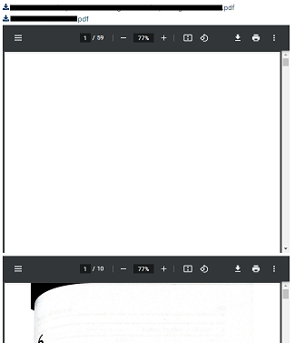
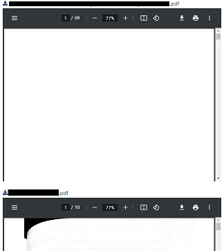

# discourse-pdf-previews
A theme component that creates previews for pdfs when they're uploaded as attachments.

Documentation at [Inline pdf previews - Discourse Meta](https://meta.discourse.org/t/inline-pdf-previews/157649)

## Explanation

When you load your PDF inside the topic it will create the following text:
`[<filename>.pdf|attachment](<upload link>)`.

With the current fix at *line 38*, if you upload multiple files you will get the following:

```markdown
[<filename1>.pdf|attachment](<upload link 1>)
[<filename2>.pdf|attachment](<upload link 2>)
```

If you leave it like this, you will get the following topic:



As you can see, both links and both previews follow one another.

If you would prefer to have one link and one preview, add a new line between the attachments in the topic, like so:

```markdown
[<filename1>.pdf|attachment](<upload link 1>)

[<filename2>.pdf|attachment](<upload link 2>)
```

You will get the following result:


